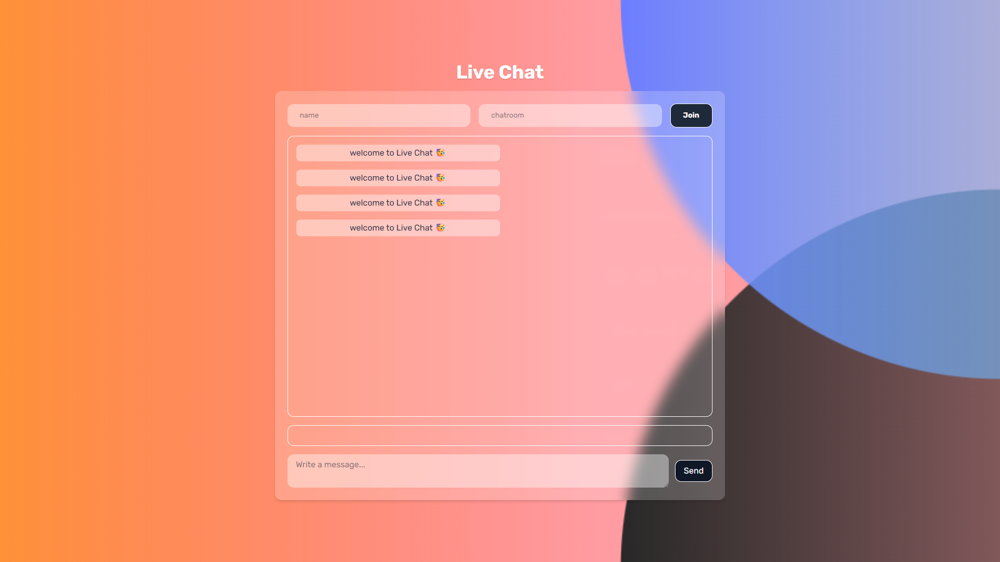

# Live Chat WebSocket Application

A real-time chat application built with Node.js, Express, and Socket.IO that allows users to join chat rooms and communicate with others in real-time.



[**Live Demo**](https://socket-vhd9.onrender.com)

## Table of Contents

-   [Project Description](#project-description)
-   [Key Features](#key-features)
-   [Installation](#installation)
-   [Usage](#usage)
-   [File Structure](#file-structure)
-   [Technologies Used](#technologies-used)
-   [Contributing](#contributing)
-   [License](#license)
-   [Support](#support)

## Project Description

Live Chat is a WebSocket-based real-time chat application that enables users to join chat rooms and communicate with others instantly. The application provides a clean, responsive interface with features like typing indicators, room management, and real-time message delivery.

The application is built using modern web technologies with a Node.js backend and a client-side interface that uses Tailwind CSS for styling.

## Key Features

-   Real-time messaging using WebSocket technology
-   Multiple chat rooms support
-   User presence indicators
-   "User is typing" notifications
-   Responsive design that works on desktop and mobile devices
-   Room management with active room listings
-   User list display for each room

## Installation

To run this application locally, you need to have Node.js installed on your system.

1. Clone the repository:

    ```bash
    git clone <repository-url>
    ```

2. Navigate to the project directory:

    ```bash
    cd socket
    ```

3. Install dependencies:

    ```bash
    npm install
    ```

4. Start the development server:

    ```bash
    npm run dev
    ```

    Or for production:

    ```bash
    npm start
    ```

The application will be available at `http://localhost:3500`.

## Usage

1. Open your browser and navigate to `http://localhost:3500`
2. Enter your name and desired chat room name
3. Click "Join" to enter the chat room
4. Start chatting with other users in the same room
5. Messages appear in real-time with timestamps
6. See who is currently typing with the activity indicator

## File Structure

```
socket/
├── server/
│   ├── public/
│   │   ├── image/
│   │   ├── index.html
│   │   ├── script.js
│   │   └── style.css
│   └── server.js
├── package.json
└── README.md
```

### Server Files

-   **[server.js](file:///S:/WIP-Codes/socket/server/server.js)**: Main server file containing the Express server setup, Socket.IO configuration, and chat room logic
-   **[index.html](file:///S:/WIP-Codes/socket/server/public/index.html)**: Main client interface with chat UI elements
-   **[script.js](file:///S:/WIP-Codes/socket/server/public/script.js)**: Client-side JavaScript handling Socket.IO events and UI interactions
-   **[style.css](file:///S:/WIP-Codes/socket/server/public/style.css)**: Custom styling for the chat interface

## Technologies Used

-   **Node.js**: JavaScript runtime environment
-   **Express**: Web application framework for Node.js
-   **Socket.IO**: Real-time bidirectional event-based communication library
-   **Tailwind CSS**: Utility-first CSS framework for styling
-   **HTML5/CSS3**: Markup and styling languages
-   **JavaScript**: Client-side scripting language

## Contributing

Contributions are welcome! To contribute to this project:

1. Fork the repository
2. Create a new branch for your feature or bug fix
3. Make your changes and commit them with descriptive messages
4. Push your changes to your fork
5. Submit a pull request with a detailed description of your changes

Please ensure your code follows the existing style and includes appropriate comments.

## License

This project is licensed under the ISC License. See the [LICENSE](file:///S:/WIP-Codes/socket/LICENSE) file for details.

## Support

For support, questions, or feedback, please open an issue on the repository or contact the project maintainer.

The application is configured to run on port 3500 by default. If you need to change the port, you can set the `PORT` environment variable before starting the server.
